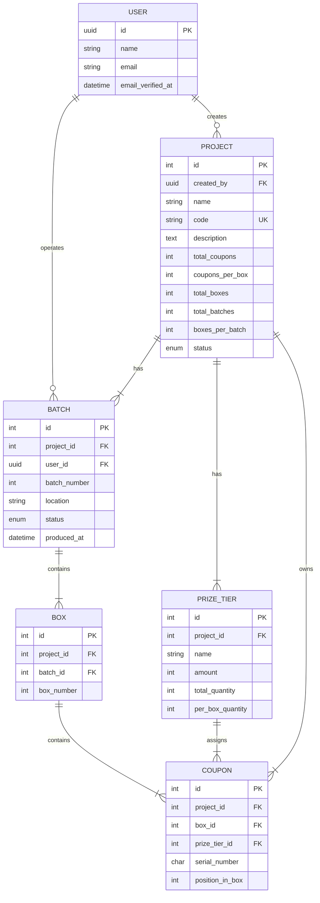

# Coupon Production System — Mobile App Specification

> A complete specification for an AI agent to build a mobile app client that replicates all features of the existing web application.

---

## 1. Application Purpose

The **Coupon Production System** is an internal admin tool for managing **instant-prize coupon campaigns** (Indonesian: "kupon undian berhadiah langsung"). Companies use it to:

1. Configure a promotional campaign (called a "Project")
2. Define prize tiers (e.g., Rp 100,000 / Rp 50,000 / No Prize)
3. Generate randomized coupons organized into boxes and production batches
4. View distribution reports to verify prize allocation fairness
5. Export coupon data to Excel for printing

**Target users:** Internal operators / admin staff who manage coupon production.

**Currency:** Indonesian Rupiah (IDR / Rp). Format: `Rp 100.000` (dot as thousands separator, no decimals).

---

## 2. Domain Glossary

| Term | Definition |
|------|-----------|
| **Project** | A campaign configuration. Contains all settings for a coupon generation run. |
| **Prize Tier** | A prize level within a project. Each tier has a name, monetary amount, and quantity-per-box. |
| **Batch** | A production run. A project is divided into N batches. Each batch generates coupons for a subset of boxes. |
| **Box** | A physical box of coupons. Each box contains exactly `coupons_per_box` coupons with prizes distributed per the tier config. |
| **Coupon** | An individual coupon with a unique serial number, a position in its box, and an assigned prize tier. |
| **Operator** | The authenticated user who triggers batch generation. Recorded on the batch for audit purposes. |

### Hierarchy

```
Project
├── Prize Tiers (1..N)
├── Batches (1..N)
│   └── Boxes (1..N per batch)
│       └── Coupons (exactly coupons_per_box per box)
```

---

## 3. User Roles & Authentication

### Auth Features (Enabled)

| Feature | Status | Notes |
|---------|--------|-------|
| Login (email + password) | ✅ Enabled | Main entry point |


### Auth for Mobile (Token-Based)

The web app uses cookie/session auth. For mobile, use **Laravel Sanctum token-based auth**:

```
POST /api/v1/auth/login
```
```json
{
  "email": "user@example.com",
  "password": "secret123",
  "device_name": "iPhone 15 Pro"
}
```
→ Returns `{ "token": "1|abc...", "user": {...} }`

```
POST /api/v1/auth/logout  (Bearer token required)
```
→ Revokes current token

> **IMPORTANT:** These auth endpoints do NOT exist yet in the backend. They need to be created. Implementation code is provided in the API specification file (`api_specification.md`, Section 8.1).

**Token storage:**
- iOS → Keychain
- Android → EncryptedSharedPreferences
- Flutter → `flutter_secure_storage`
- React Native → `react-native-keychain`

---

## 4. Navigation Structure

### Sidebar (Main Navigation)

| Icon | Label | Route | Description |
|------|-------|-------|-------------|
| `LayoutGrid` | Dashboard | `/dashboard` | Overview stats + recent projects |
| `FolderGit2` | Coupon Projects | `/projects` | Project list |

### Footer Navigation

| Label | Action |
|-------|--------|
| Repository | External link (GitHub) |
| User Menu | Dropdown: Settings, Logout |

### Settings Sub-Navigation

| Label | Route | Description |
|-------|-------|-------------|
| Profile | `/settings/profile` | Update name & email |
| Password | `/settings/password` | Change password |
| Appearance | `/settings/appearance` | Light/Dark mode toggle |
| Two-Factor | `/settings/two-factor` | Enable/Disable 2FA |

### Mobile Navigation Recommendation

```
Bottom Tab Bar:
  ├── Dashboard (Home)
  ├── Projects (List)
  └── Settings (Profile/Password/2FA/Appearance)
```

---

## 5. Screen-by-Screen Specification

### 5.1 Login Screen

**Route:** `/login`

**UI Elements:**
- Email input field
- Password input field (with show/hide toggle)
- "Remember me" checkbox
- "Forgot password?" link → Password Reset flow
- "Login" button
- "Register" link → Registration screen

**API:** `POST /api/v1/auth/login` (to be created)

**Behavior:**
- On success → navigate to Dashboard
- If user has 2FA enabled → redirect to Two-Factor Challenge screen
- On validation error → show field-level errors
- Rate limited: 5 attempts per minute

---

### 5.2 Registration Screen

**Route:** `/register`

**UI Elements:**
- Name input
- Email input
- Password input
- Confirm password input
- "Register" button
- "Already have an account? Login" link

**API:** `POST /api/v1/auth/register` (to be created)

**Behavior:**
- On success → redirect to email verification notice
- Show validation errors inline

---

### 5.3 Dashboard Screen

**Route:** `/dashboard`  
**Middleware:** `auth`, `verified`

**UI Elements:**
- Page title: "Overview"
- Subtitle: "Instant Prize Coupon Generation System Analytics"
- "Create New Run" button → navigates to Create Project

**Stats Cards (3 cards in a row):**

| Card | Icon | Color Accent | Value | Subtitle |
|------|------|-------------|-------|----------|
| Total Projects | `FolderKanban` | Blue left border | `total_projects` | "Active configurations" |
| Generated Batches | `Box` | Orange left border | `total_batches` | "Production batches processed" |
| Total Coupons | `Ticket` | Emerald left border | `total_coupons` | "Individual serials generated" |

**Recent Projects Table:**

| Column | Description |
|--------|-------------|
| Code | Project code (monospace font) |
| Project Name | Full name |
| Status | Badge with color: `ready`=green, `generating`=amber, `draft`=slate |
| Coupons | Formatted number (e.g., "10,000") |
| Created By | Creator name |
| Action | "Details" button → Project Detail |

**API:** `GET /api/v1/dashboard/stats`

**Loading state:** Skeleton placeholders while data loads.

---

### 5.4 Projects List Screen

**Route:** `/projects`  
**Middleware:** `auth`, `verified`

**UI Elements:**
- Page title: "Coupon Projects"
- Subtitle: "Manage and track your generated coupon systems."
- "Create New Project" button → Create Project screen

**Project Cards (grid layout, 3 columns on desktop):**

Each card shows:
- **Code** — monospace badge (e.g., `PROMO-2026-01`)
- **Status** — colored badge (`draft`/`generating`/`ready`/`in_production`/`completed`)
- **Name** — project title
- **Description** — truncated to 2 lines, or "No description provided"
- **Total Coupons** — formatted number
- **"View Details" button** → Project Detail screen

**Empty state:** "No projects found. Create one to get started." with a "Create Project" button.

**API:** `GET /api/v1/projects` (paginated)

---

### 5.5 Create Project Screen

**Route:** `/projects/create`  
**Middleware:** `auth`, `verified`

This is a **multi-section form** with two cards:

#### Card 1: Basic Information

| Field | Type | Required | Notes |
|-------|------|----------|-------|
| Project Name | text | ✅ | Default: "Promo Akhir Tahun" |
| Project Code | text | ✅ | Auto-uppercased, unique, max 30 chars. Placeholder: "PROMO-2026-01" |
| Description | text | ❌ | Optional |
| Total Coupons | number | ✅ | Default: 10,000 |
| Coupons per Box | number | ✅ | Default: 1,000 |
| Total Batches | number | ✅ | Default: 2 |
| Total Boxes | number | — | **Auto-calculated:** `ceil(total_coupons / coupons_per_box)`. Read-only. |
| Boxes per Batch | number | — | **Auto-calculated:** `ceil(total_boxes / total_batches)`. Read-only. |

#### Card 2: Prize Tier Configuration

A dynamic table where users add/remove prize tiers:

| Column | Type | Notes |
|--------|------|-------|
| Prize Tier Name | text | e.g., "Hadiah Rp 100.000" |
| Amount (Rp) | number | Prize value in IDR. `0` = no prize |
| Per Box Quantity | number | How many of this tier go in each box |
| Total Quantity (Auto) | display | `per_box_quantity × total_boxes` (read-only) |
| Delete | button | Remove this tier row |

- **"Add Tier" button** at top of table
- **Footer validation row:** Shows `currentTotal / coupons_per_box` — must match exactly. Green when valid, red when invalid.

**Default tiers (6 rows):**

| Name | Amount | Per Box Qty |
|------|--------|-------------|
| Hadiah Rp 100.000 | 100,000 | 5 |
| Hadiah Rp 50.000 | 50,000 | 10 |
| Hadiah Rp 20.000 | 20,000 | 25 |
| Hadiah Rp 10.000 | 10,000 | 50 |
| Hadiah Rp 5.000 | 5,000 | 100 |
| Anda Belum Beruntung | 0 | 810 |

**Validation rule:** Sum of all `per_box_quantity` must equal `coupons_per_box`. The submit button is disabled until this is satisfied.

**Submit behavior:**
- Payload includes `tiers[].total_quantity` computed as `per_box_quantity × total_boxes`
- On success → navigate to Projects List
- On error → show error message at top of form

**API:** `POST /api/v1/projects`

---

### 5.6 Project Detail Screen

**Route:** `/projects/{id}`  
**Middleware:** `auth`, `verified`

This screen has a **tabbed interface** with 3 tabs:

#### Header
- Project name (large title)
- Status badge
- Project code (monospace)
- **"Delete Project" button** (destructive) — requires confirmation dialog

#### Tab 1: Overview

Shows 3 info cards:
- **Configuration** — total coupons count, "Split into X boxes (Y per box)"
- **Batches** — total batch count, "Production batches mapped to this run"
- **Created By** — creator name, creation date

#### Tab 2: Batches

Grid of batch cards. Each card shows:
- **Batch #{number}** — title
- **Status badge** — `pending` (slate), `in_progress` (amber), `completed` (green)
- **Description** — if completed: "Generated by {operator} at {location} • {timestamp}". If pending: "Awaiting operator generation"

**Actions per batch:**
- **If pending:** "Generate Batch" button → opens Location Modal
- **If completed:** 
  - "View Distribution Report" button → Batch Report screen
  - "View Generated Coupons" button → switches to Coupons tab filtered by this batch

**Location Modal (before generation):**
- Title: "Set Production Location"
- Text input with placeholder: "e.g. HQ Production Facility, Jakarta"
- Cancel + "Start Generation" buttons
- Enter key submits

**API:** 
- `GET /api/v1/projects/{id}/batches` — load batch list
- `POST /api/v1/batches/{batchId}/generate` — trigger generation with `{ "location": "..." }`

#### Tab 3: Generated Coupons

Only enabled when project status ≠ `draft`.

**Toolbar:**
- Title: "Generated Coupons" with "Showing X-Y of Z coupons" counter
- **"Export Excel" button** — downloads `.xlsx` file
- **Search input** — searches by serial number (debounced 400ms)
- **Batch filter dropdown** — "All Batches" or specific completed batches
- **Prize Tier filter dropdown** — "All Prize Tiers" or specific tiers (shows amount for winning tiers)
- **Rows per page selector** — 25, 50, 100, 250, 500
- **Sort order selector** — "Ascending (001→end)" or "Descending (end→001)"

**Data Table columns:**

| Column | Sortable | Display |
|--------|----------|---------|
| Serial Number | ✅ | Monospace, tracking-widest (e.g., `00001`) |
| Box | ❌ | "Box #1" |
| Position | ✅ | Position number in box |
| Prize Tier | ❌ | Colored badge: green for winning, muted for no-prize |
| Amount | ❌ | IDR formatted or "—" for zero |

**Pagination:** Previous/Next buttons at bottom with page indicator.

**API:**
- `GET /api/v1/projects/{id}/coupons?tier_id=&batch_id=&search=&sort=&per_page=&page=`
- `GET /api/v1/projects/{id}/coupons/export?tier_id=` (file download)

**Delete Project:**
- Confirmation dialog: "Are you sure you want to permanently delete this project and all its generated coupons? This action cannot be undone."
- `DELETE /api/v1/projects/{id}`
- On success → navigate back to Projects List

---

### 5.7 Batch Report Screen

**Route:** `/batches/{id}/report`  
**Middleware:** `auth`, `verified`

**Header:**
- Back button → Projects List
- Title: "Batch #{number} Report"
- Subtitle: "Project: {project_name}"

**Summary Cards (4 columns):**

| Label | Value |
|-------|-------|
| Operator | Operator name |
| Location | Production location |
| Total Boxes | Box count |
| Status | Status value (capitalized) |

**Box Distribution Section:**

Grid of box cards. Each card:
- Title: "Box #{number}" with coupon count
- Table showing prize distribution: prize name → count

**API:** `GET /api/v1/batches/{batchId}/report`

---

### 5.8 Settings Screens

#### Profile Settings
- Name input (editable)
- Email input (editable)
- Save button

#### Password Settings
- Current password input
- New password input
- Confirm new password input
- Save button

#### Appearance Settings
- Light / Dark / System theme toggle


## 6. Data Models & Relationships



### Status Enums

**ProjectStatus:** `draft` → `generating` → `ready` → `in_production` → `completed`

**BatchStatus:** `pending` → `in_progress` → `completed`

---

## 7. Business Logic Rules

### Project Creation
1. Project code must be unique across all projects
2. Sum of all `tiers.*.per_box_quantity` **must equal** `coupons_per_box`
3. Creating a project auto-creates N empty batches (status: `pending`)
4. Initial project status is `draft`

### Coupon Generation
1. Can only generate for batches with `pending` status
2. On generation start: batch → `in_progress`, project → `generating` (if was `draft`)
3. Box numbers are globally sequential across batches
4. Serial numbers are zero-padded to 5 chars: `00001`, `00002`, etc.
5. Prizes are **randomized within each box** — no two adjacent same-value winning coupons
6. On generation complete: batch → `completed`, operator recorded
7. When **all** batches complete: project → `ready`

### Project Deletion
- Cascade deletes all: batches, boxes, coupons, prize tiers

---

## 8. Complete API Endpoint Table

| Method | Endpoint | Description |
|--------|----------|-------------|
| `GET` | `/api/user` | Current user info |
| `GET` | `/api/v1/dashboard/stats` | Dashboard statistics |
| `GET` | `/api/v1/projects` | List projects (paginated) |
| `POST` | `/api/v1/projects` | Create project |
| `GET` | `/api/v1/projects/{id}` | Project detail + prize tiers |
| `DELETE` | `/api/v1/projects/{id}` | Delete project |
| `GET` | `/api/v1/projects/{id}/batches` | List project batches |
| `GET` | `/api/v1/projects/{id}/coupons` | List coupons (filtered, paginated) |
| `GET` | `/api/v1/projects/{id}/coupons/export` | Download Excel |
| `POST` | `/api/v1/batches/{id}/generate` | Generate batch coupons |
| `GET` | `/api/v1/batches/{id}/report` | Batch distribution report |

> For detailed request/response JSON examples, see `api_specification.md`.

---

## 9. UI Behavior Notes

### Loading States
- All screens show **skeleton placeholders** while loading
- Buttons show loading text (e.g., "Creating Project...", "Generating Algorithm...")

### Status Badge Colors

| Status | Background | Text |
|--------|-----------|------|
| `draft` | `slate-500/10` | `slate-600` |
| `generating` / `in_progress` | `amber-500/10` | `amber-600` |
| `ready` / `completed` | `green-500/10` | `green-600` |

### Number Formatting
- Use `Intl.NumberFormat()` for counts: `10,000`
- Currency: `Intl.NumberFormat('id-ID', { style: 'currency', currency: 'IDR', maximumFractionDigits: 0 })`

### Dark Mode
- The web app supports light/dark/system themes — mobile should too

### Confirmation Dialogs
- Delete Project requires explicit confirmation
- Batch generation shows location input modal first

### Empty States
- Projects: "No projects found. Create one to get started."
- Coupons: "No coupons found. Generate a batch to get started."
- Report: "Report not found."
