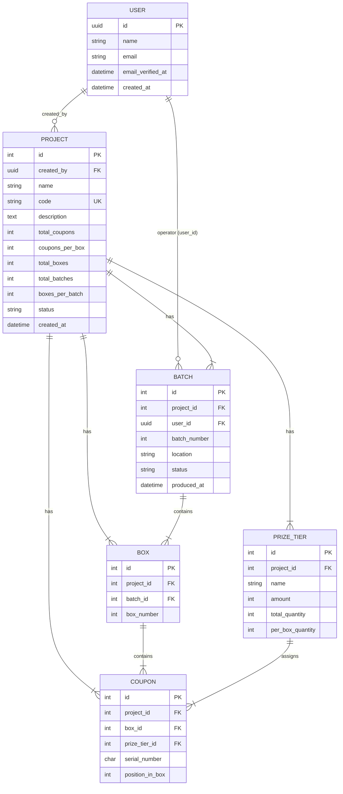

# Coupon Production System — API Specification

> **Version:** 1.0  
> **Base URL:** `{YOUR_DOMAIN}/api/v1`  
> **Auth:** Laravel Sanctum (Bearer Token)

---

## 1. Application Overview

The **Coupon Production System** is an instant-prize coupon generation platform for promotional campaigns. It manages the full lifecycle:

1. **Create a Project** — define campaign parameters (total coupons, box structure, prize tiers)
2. **Generate Batches** — trigger coupon generation per batch with randomized prize distribution
3. **Browse & Export Coupons** — view, filter, search, paginate, and export generated coupons
4. **Batch Reports** — view per-box prize distribution reports

### Key Concepts

| Concept | Description |
|---------|-------------|
| **Project** | A campaign configuration defining how many coupons, boxes, batches, and prize tiers exist |
| **Prize Tier** | A prize level within a project (e.g., "Rp 100,000", "Rp 50,000", "No Prize") |
| **Batch** | A production run within a project. Each batch contains N boxes |
| **Box** | A physical box of coupons. Each box contains exactly `coupons_per_box` coupons |
| **Coupon** | An individual coupon with a serial number, position in box, and assigned prize tier |

---

## 2. Authentication

The API uses **Laravel Sanctum** with personal access tokens (ideal for mobile clients).

### 2.1 Login — Get Token

```
POST /api/v1/auth/login
```

> [!IMPORTANT]
> This endpoint does **not yet exist** in the current codebase. You will need to create it for mobile auth. See [Section 8: Mobile Integration Guide](#8-mobile-client-integration-guide) for implementation details.

**Request Body:**
```json
{
  "email": "user@example.com",
  "password": "secret123",
  "device_name": "iPhone 15 Pro"
}
```

**Response (200):**
```json
{
  "token": "1|abc123def456...",
  "user": {
    "id": "9e3a4b5c-...",
    "name": "John Doe",
    "email": "user@example.com"
  }
}
```

### 2.2 Get Current User

```
GET /api/user
```

**Headers:** `Authorization: Bearer {token}`

**Response (200):**
```json
{
  "id": "9e3a4b5c-...",
  "name": "John Doe",
  "email": "user@example.com",
  "email_verified_at": "2026-05-20T12:00:00.000000Z",
  "created_at": "2026-05-20T10:00:00.000000Z",
  "updated_at": "2026-05-20T10:00:00.000000Z"
}
```

### 2.3 Using Authentication

All `/api/v1/*` endpoints require the header:

```
Authorization: Bearer {token}
Accept: application/json
```

---

## 3. Data Models

### ER Diagram



### Enums

**ProjectStatus:**
| Value | Description |
|-------|-------------|
| `draft` | Newly created, no batches generated yet |
| `generating` | At least one batch is being generated |
| `ready` | All batches have been generated |
| `in_production` | Coupons are in physical production |
| `completed` | Campaign is finished |

**BatchStatus:**
| Value | Description |
|-------|-------------|
| `pending` | Awaiting coupon generation |
| `in_progress` | Currently generating coupons |
| `completed` | Coupons have been generated |

---

## 4. API Endpoints

### 4.1 Dashboard

#### `GET /api/v1/dashboard/stats`

Returns aggregate statistics and recent projects.

**Response (200):**
```json
{
  "data": {
    "total_projects": 5,
    "total_batches": 12,
    "total_coupons": 50000,
    "recent_projects": [
      {
        "id": 1,
        "code": "PROMO-2026-01",
        "name": "Promo Akhir Tahun",
        "description": "Year-end promotional coupons",
        "status": "ready",
        "config": {
          "total_coupons": 10000,
          "total_boxes": 10,
          "coupons_per_box": 1000,
          "total_batches": 2,
          "boxes_per_batch": 5
        },
        "creator": {
          "id": "9e3a4b5c-...",
          "name": "John Doe"
        },
        "created_at": "2026-05-20T12:00:00+00:00"
      }
    ]
  }
}
```

---

### 4.2 Projects

#### `GET /api/v1/projects`

List all projects (paginated).

**Response (200):**
```json
{
  "data": [
    {
      "id": 1,
      "code": "PROMO-2026-01",
      "name": "Promo Akhir Tahun",
      "description": "Year-end promotional coupons",
      "status": "ready",
      "config": {
        "total_coupons": 10000,
        "total_boxes": 10,
        "coupons_per_box": 1000,
        "total_batches": 2,
        "boxes_per_batch": 5
      },
      "creator": {
        "id": "9e3a4b5c-...",
        "name": "John Doe"
      },
      "created_at": "2026-05-20T12:00:00+00:00"
    }
  ],
  "links": { "first": "...", "last": "...", "prev": null, "next": "..." },
  "meta": {
    "current_page": 1,
    "last_page": 1,
    "per_page": 15,
    "total": 1
  }
}
```

---

#### `POST /api/v1/projects`

Create a new project with prize tiers. Automatically creates batches.

**Request Body:**
```json
{
  "name": "Promo Akhir Tahun",
  "code": "PROMO-2026-01",
  "description": "Year-end promotional coupons",
  "total_coupons": 10000,
  "coupons_per_box": 1000,
  "total_boxes": 10,
  "total_batches": 2,
  "boxes_per_batch": 5,
  "tiers": [
    {
      "name": "Hadiah Rp 100.000",
      "amount": 100000,
      "total_quantity": 50,
      "per_box_quantity": 5
    },
    {
      "name": "Hadiah Rp 50.000",
      "amount": 50000,
      "total_quantity": 100,
      "per_box_quantity": 10
    },
    {
      "name": "Anda Belum Beruntung",
      "amount": 0,
      "total_quantity": 8500,
      "per_box_quantity": 850
    }
  ]
}
```

**Validation Rules:**

| Field | Rules |
|-------|-------|
| `name` | required, string, max 255 |
| `code` | required, string, max 30, unique |
| `description` | nullable, string |
| `total_coupons` | required, integer, min 1 |
| `coupons_per_box` | required, integer, min 1 |
| `total_boxes` | required, integer, min 1 |
| `total_batches` | required, integer, min 1 |
| `boxes_per_batch` | required, integer, min 1 |
| `tiers` | required, array, min 1 item |
| `tiers.*.name` | required, string, max 255 |
| `tiers.*.amount` | required, integer, min 0 |
| `tiers.*.total_quantity` | required, integer, min 1 |
| `tiers.*.per_box_quantity` | required, integer, min 1 |

> [!TIP]
> The sum of all `tiers.*.per_box_quantity` **must equal** `coupons_per_box`. The frontend auto-calculates `total_quantity = per_box_quantity × total_boxes`.

**Response (201):**
```json
{
  "message": "Project created successfully",
  "data": {
    "id": 1,
    "code": "PROMO-2026-01",
    "name": "Promo Akhir Tahun",
    "description": "Year-end promotional coupons",
    "status": "draft",
    "config": { "..." },
    "creator": { "id": "...", "name": "John Doe" },
    "created_at": "2026-05-20T12:00:00+00:00"
  }
}
```

**Response (422 — Validation Error):**
```json
{
  "message": "The code has already been taken.",
  "errors": {
    "code": ["The code has already been taken."]
  }
}
```

---

#### `GET /api/v1/projects/{project}`

Get project details with prize tiers.

**Path Parameters:**
| Name | Type | Description |
|------|------|-------------|
| `project` | integer | Project ID |

**Response (200):**
```json
{
  "data": {
    "id": 1,
    "code": "PROMO-2026-01",
    "name": "Promo Akhir Tahun",
    "description": "Year-end promotional coupons",
    "status": "ready",
    "config": {
      "total_coupons": 10000,
      "total_boxes": 10,
      "coupons_per_box": 1000,
      "total_batches": 2,
      "boxes_per_batch": 5
    },
    "creator": { "id": "...", "name": "John Doe" },
    "prize_tiers": [
      { "id": 1, "name": "Hadiah Rp 100.000", "amount": 100000 },
      { "id": 2, "name": "Hadiah Rp 50.000", "amount": 50000 },
      { "id": 3, "name": "Anda Belum Beruntung", "amount": 0 }
    ],
    "created_at": "2026-05-20T12:00:00+00:00"
  }
}
```

---

#### `DELETE /api/v1/projects/{project}`

Permanently delete a project and all associated data (batches, boxes, coupons, prize tiers).

**Response (200):**
```json
{
  "message": "Project and all its associated data have been permanently deleted."
}
```

---

### 4.3 Project Batches

#### `GET /api/v1/projects/{project}/batches`

List all batches for a project.

**Response (200):**
```json
{
  "data": [
    {
      "id": 1,
      "project_id": 1,
      "user_id": null,
      "batch_number": 1,
      "location": null,
      "status": "pending",
      "produced_at": null,
      "created_at": "2026-05-20T12:00:00.000000Z",
      "updated_at": "2026-05-20T12:00:00.000000Z",
      "operator": null
    },
    {
      "id": 2,
      "project_id": 1,
      "user_id": "9e3a...",
      "batch_number": 2,
      "location": "HQ Production Facility",
      "status": "completed",
      "produced_at": "2026-05-20T14:30:00.000000Z",
      "created_at": "2026-05-20T12:00:00.000000Z",
      "updated_at": "2026-05-20T14:30:00.000000Z",
      "operator": {
        "id": "9e3a...",
        "name": "John Doe"
      }
    }
  ]
}
```

---

### 4.4 Coupon Generation

#### `POST /api/v1/batches/{batch}/generate`

Trigger coupon generation for a pending batch. Generates randomized coupons for all boxes in the batch with prize distribution according to the project's tier configuration.

**Path Parameters:**
| Name | Type | Description |
|------|------|-------------|
| `batch` | integer | Batch ID |

**Request Body (optional):**
```json
{
  "location": "Jakarta Production Facility"
}
```

> [!NOTE]
> If `location` is omitted, defaults to `"HQ Production Facility"`.

**Response (200):**
```json
{
  "message": "Batch coupons generated successfully.",
  "status": "completed"
}
```

**Response (400 — Batch Not Pending):**
```json
{
  "message": "Failed to generate coupons.",
  "error": "Batch must be in pending status to generate coupons."
}
```

**Business Rules:**
- Batch must be in `pending` status
- The authenticated user is recorded as the batch operator
- Project status transitions: `draft` → `generating` → `ready` (when all batches complete)
- Prize coupons are randomized within each box ensuring no two adjacent high-value prizes

---

### 4.5 Project Coupons

#### `GET /api/v1/projects/{project}/coupons`

List coupons for a project with filtering, search, sorting, and pagination.

**Query Parameters:**
| Name | Type | Default | Description |
|------|------|---------|-------------|
| `tier_id` | integer | — | Filter by prize tier ID |
| `batch_id` | integer | — | Filter by batch ID |
| `search` | string | — | Search by serial number (partial match) |
| `sort` | string | `asc` | Sort order: `asc` or `desc` |
| `per_page` | integer | `50` | Items per page (max 500) |
| `page` | integer | `1` | Page number |

**Response (200):**
```json
{
  "current_page": 1,
  "data": [
    {
      "id": 1,
      "project_id": 1,
      "box_id": 1,
      "prize_tier_id": 3,
      "serial_number": "00001",
      "position_in_box": 1,
      "created_at": "2026-05-20T14:30:00.000000Z",
      "updated_at": "2026-05-20T14:30:00.000000Z",
      "prize_tier": {
        "id": 3,
        "project_id": 1,
        "name": "Anda Belum Beruntung",
        "amount": 0,
        "total_quantity": 8500,
        "per_box_quantity": 850,
        "created_at": "...",
        "updated_at": "..."
      },
      "box": {
        "id": 1,
        "project_id": 1,
        "batch_id": 1,
        "box_number": 1,
        "created_at": "...",
        "updated_at": "..."
      }
    }
  ],
  "first_page_url": "...?page=1",
  "from": 1,
  "last_page": 200,
  "last_page_url": "...?page=200",
  "next_page_url": "...?page=2",
  "per_page": 50,
  "prev_page_url": null,
  "to": 50,
  "total": 10000
}
```

---

#### `GET /api/v1/projects/{project}/coupons/export`

Download all coupons as an Excel (.xlsx) file.

**Query Parameters:**
| Name | Type | Description |
|------|------|-------------|
| `tier_id` | integer | Optional. Filter export by prize tier ID |

**Response:** Binary file download (`application/vnd.openxmlformats-officedocument.spreadsheetml.sheet`)

**Excel Columns:**
| Column | Description |
|--------|-------------|
| Serial Number | 5-char zero-padded serial |
| Box Number | Box number within project |
| Position In Box | Position index within the box |
| Prize Tier | Prize tier name |
| Prize Amount | Prize monetary value |
| Generated At | Timestamp of generation |

> [!TIP]
> For mobile, you can download this file and share it via the OS share sheet, or open it with a document viewer.

---

### 4.6 Batch Report

#### `GET /api/v1/batches/{batch}/report`

Get detailed distribution report for a completed batch.

**Response (200):**
```json
{
  "data": {
    "batch_number": 1,
    "project_name": "Promo Akhir Tahun",
    "operator": {
      "id": "9e3a...",
      "name": "John Doe"
    },
    "location": "HQ Production Facility",
    "status": "completed",
    "produced_at": "2026-05-20T14:30:00+00:00",
    "total_boxes": 5,
    "boxes": [
      {
        "box_number": 1,
        "total_coupons": 1000,
        "prize_distribution": {
          "Hadiah Rp 100.000": 5,
          "Hadiah Rp 50.000": 10,
          "Hadiah Rp 20.000": 25,
          "Hadiah Rp 10.000": 50,
          "Hadiah Rp 5.000": 100,
          "Anda Belum Beruntung": 810
        }
      },
      {
        "box_number": 2,
        "total_coupons": 1000,
        "prize_distribution": { "..." }
      }
    ]
  }
}
```

---

## 5. Error Handling

### Standard Error Responses

**401 Unauthorized:**
```json
{
  "message": "Unauthenticated."
}
```

**403 Forbidden:**
```json
{
  "message": "This action is unauthorized."
}
```

**404 Not Found:**
```json
{
  "message": "No query results for model [App\\Models\\Project] 999"
}
```

**422 Validation Error:**
```json
{
  "message": "The name field is required.",
  "errors": {
    "name": ["The name field is required."],
    "code": ["The code has already been taken."]
  }
}
```

**500 Server Error:**
```json
{
  "message": "Server Error"
}
```

---

## 6. Pagination Pattern

All paginated endpoints use Laravel's standard pagination format:

```json
{
  "current_page": 1,
  "data": [],
  "first_page_url": "http://...?page=1",
  "from": 1,
  "last_page": 10,
  "last_page_url": "http://...?page=10",
  "next_page_url": "http://...?page=2",
  "per_page": 15,
  "prev_page_url": null,
  "to": 15,
  "total": 150
}
```

---

## 7. Endpoint Summary

| Method | Endpoint | Description | Auth |
|--------|----------|-------------|------|
| `GET` | `/api/user` | Get current user | ✅ |
| `GET` | `/api/v1/dashboard/stats` | Dashboard statistics | ✅ |
| `GET` | `/api/v1/projects` | List projects (paginated) | ✅ |
| `POST` | `/api/v1/projects` | Create project + tiers + batches | ✅ |
| `GET` | `/api/v1/projects/{project}` | Project detail with tiers | ✅ |
| `DELETE` | `/api/v1/projects/{project}` | Delete project permanently | ✅ |
| `GET` | `/api/v1/projects/{project}/batches` | List batches for project | ✅ |
| `GET` | `/api/v1/projects/{project}/coupons` | List coupons (filtered, paginated) | ✅ |
| `GET` | `/api/v1/projects/{project}/coupons/export` | Export coupons as Excel | ✅ |
| `POST` | `/api/v1/batches/{batch}/generate` | Generate coupons for batch | ✅ |
| `GET` | `/api/v1/batches/{batch}/report` | Batch distribution report | ✅ |

---

## 8. Mobile Client Integration Guide

### 8.1 Auth Endpoint to Create

The current API uses Sanctum cookie-based auth for the SPA. For mobile, you need a **token-based** login endpoint. Create this controller:

```
POST /api/v1/auth/login     → Issue token
POST /api/v1/auth/logout    → Revoke token
```

**Implementation sketch (to add in `routes/api.php`):**

```php
Route::prefix('v1')->group(function () {
    Route::post('/auth/login', function (Request $request) {
        $request->validate([
            'email' => 'required|email',
            'password' => 'required',
            'device_name' => 'required',
        ]);

        $user = User::where('email', $request->email)->first();

        if (! $user || ! Hash::check($request->password, $user->password)) {
            throw ValidationException::withMessages([
                'email' => ['The provided credentials are incorrect.'],
            ]);
        }

        return response()->json([
            'token' => $user->createToken($request->device_name)->plainTextToken,
            'user' => $user,
        ]);
    });

    Route::middleware('auth:sanctum')->post('/auth/logout', function (Request $request) {
        $request->user()->currentAccessToken()->delete();
        return response()->json(['message' => 'Logged out']);
    });
});
```

### 8.2 Mobile App Screen Mapping

| Web Page | Mobile Screen | API Endpoints Used |
|----------|--------------|-------------------|
| Login | Login Screen | `POST /auth/login` |
| Dashboard | Home/Dashboard | `GET /dashboard/stats` |
| Projects List | Projects List | `GET /projects` |
| Create Project | Create Project Form | `POST /projects` |
| Project Detail — Overview | Project Detail | `GET /projects/{id}`, `GET /projects/{id}/batches` |
| Project Detail — Batches | Batches Tab/Screen | `GET /projects/{id}/batches` |
| Project Detail — Generate | Generate Action | `POST /batches/{id}/generate` |
| Project Detail — Coupons | Coupons List | `GET /projects/{id}/coupons` |
| Export Coupons | Share/Download | `GET /projects/{id}/coupons/export` |
| Batch Report | Report Detail | `GET /batches/{id}/report` |
| Delete Project | Delete Action | `DELETE /projects/{id}` |

### 8.3 Recommended HTTP Headers

```
Authorization: Bearer {token}
Accept: application/json
Content-Type: application/json
```

### 8.4 Token Storage

Store the Sanctum token securely:
- **iOS:** Keychain
- **Android:** EncryptedSharedPreferences
- **Flutter:** flutter_secure_storage
- **React Native:** react-native-keychain
